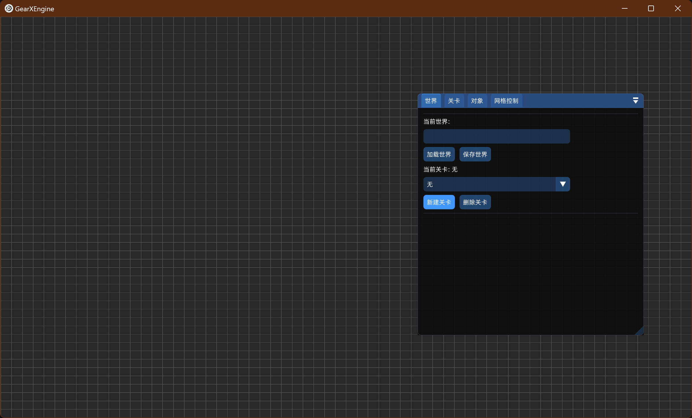
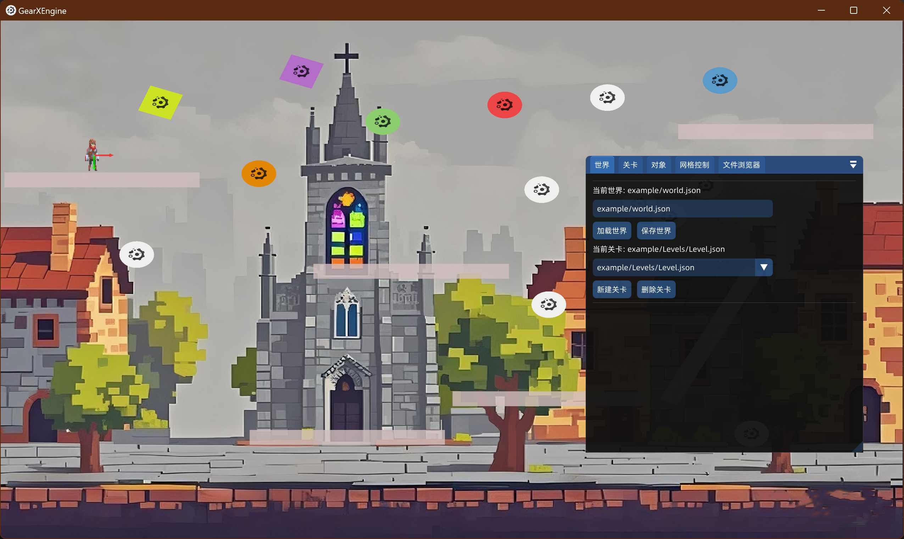
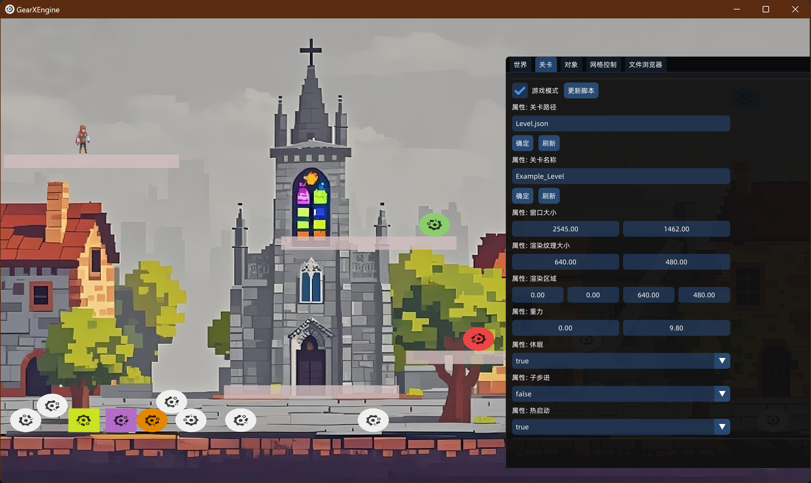

# GearX : A Simple 2D Game Engine


GearX 是一个开源的 2D 游戏引擎。

---
## 前言
###  起源
高考后的暑假，我在B站上看了[GAMES 104](https://games104.boomingtech.com/sc/)课程，从那时起我就心里有了一个Idea，就是自己写一个游戏引擎，但那时自己的编程能力还不熟练，所以一直没开始。然后我开始学习相关的技术，提升自己的能力。而在一个月前，我开始了引擎的编写。目前引擎已经基本完成（应该），并且已经可以运行，因为时间原因(才弄了一个月)，这个游戏引擎的功能还很简单，以后有时间引擎会进行升级。同时也在这里求点个Star，拜托了，这对我很重要。
### GearX 介绍

GearX 是一个2D游戏引擎，使用C++编写，Cmake构建，基于SDL3 开发。
因为这个引擎是使用SDL3的，使用当从Windows移植到Linux时，只需要修改和
导入对应平台的SDL3的库文件即可。

- 这个引擎使用了以下第三方库：
    - 渲染、音频 | SDL3  (https://www.libsdl.org/)
    - 物理引擎   | Box2D (https://github.com/erincatto/box2d)
    - 脚本支持   | Lua (https://www.lua.org/)
    - 脚本绑定   | sol2 (https://github.com/ThePhD/sol2)
    - 界面UI     | ImGui (https://github.com/ocornut/imgui)
    - 运行时反射 | RTTR  (https://rttr.org/)
    - 序列化     | cereal (https://uscilab.github.io/cereal/)
- 示例
    - GearX/example 下有一个示例工程，将example复制到可执行文件所在的目录下，
    打开引擎，在 世界->当前世界->输入框中输入"example/world.json"，点击"加载世  界"按钮，即可启动示例工程。
    - 引擎支持的脚本语言为Lua，脚本支持的语法和Lua 5.4.4相同。
    - 引擎简单地集成了Box2D 引擎 （还未集成Box2D 中的约束）
- 引擎使用 : Lua 脚本编写
    - 可用使用 EmmyLua 获取Lua 脚本的提示，只需要在IDE 中安装EmmyLua插件，同时
    将`GearX/asset/GearX.d.lua`文件复制到IDE工作区的根目录下即可
    - [Lua API 参考](./GearXLuaAPI.md)
- 关于
    - 这个引擎开发用时一个月（实际上远远不到一个月），从5.1号开始直到现在。
    - 这个引擎还有许多需要完善的地方，一些功能并没有实现。
    - 这个项目是我学习游戏引擎所做出的一个小引擎。
    - 这个引擎我也不知道我会不会继续开发，所有暂时放在这儿了。
###  新的想法：一个使用手机/平板`(Android)`进行开发的游戏引擎
其实这个想法也不算是新的，因为我之前对我这个引擎的设想就是想让游戏开发者通过使用可以随时随地进行
游戏开发，开发前为了开发效率决定使用Windows开发，然后移植到Android上,结果现在没有时间进行移植了。
所以我打算重新做一个游戏引擎(3D)。主是想的是支持在Android上进行游戏开发。现在只是一个大概的想法，
如果你对我这个项目有兴趣的话欢迎联系我/加群，来和我一同进行商讨开发细节，共同开发这个有趣的项目。

- 联系：
    - QQ: 3512241696
    - QQ群(新项目) ： 621369573

## GearX
---

### 截图

- 引擎开始界面





- 示例 ：编辑模式(example/world.json)





- 示例 ：运行模式(example/world.json)




---
## 目录结构

```
.
├── CMakeLists.txt           # CMake 构建脚本
├── main.cpp                 # 引擎主程序
├── starter.cpp              # 游戏启动入口
├── GearX/                   # 引擎核心代码
│   └── runtime/             # 运行时与核心模块
├── Depencies/               # 第三方依赖库（如 SDL3, Box2D, sol2, cereal 等）
├── build/                   # 构建输出目录
├── LICENSE.txt              # 许可证
|── GearXLuaAPI.md           # Lua API文档
└── README.md                # 项目说明文档
```

---

## 主要特性

- **组件化架构**：支持 Transform、Texture、Rigidbody、Script 等常用组件，便于灵活扩展。
- **Lua 脚本支持**：通过 Lua 脚本实现游戏逻辑热更新，提升开发效率。
- **资源管理**：统一管理图片、音频、字体、脚本等多种资源类型。
- **物理引擎集成**：集成 Box2D，支持刚体、碰撞、关节等物理特性。
- **可视化编辑器**：内置 ImGui 编辑器，支持场景、对象、属性、文件浏览等操作。
- **跨平台构建**：基于 CMake，支持 Windows、Linux 等主流平台。

---

## 快速开始

### 1. 安装依赖

- 需要 C++17 编译器、CMake、SDL3、Box2D、Lua、ImGui 等依赖库。
- 依赖库已包含在 `Depencies/` 目录,可直接编译项目。

### 2. 编译项目(你需要确保CMake可用)
- CMake 
```sh
mkdir build
cd build
cmake ..
cmake --build .
```
- Windows Visual Studio
```
在Visual  Studio中打开 项目文件夹即可。
有两个启动程序，一个是GearXEngine.exe,一个是GearXStarter.exe。
前者是引擎程序，后者是游戏启动程序。
游戏启动程序会在 example/ 目录下寻找游戏信息，
并启动游戏(world.json)。
```

### 3. 运行示例
- 运行 `GearXStarter` 或自定义的可执行文件。

### 4. 引擎Lua API 文档
-  [GearXEngine API  文档](GearXLuaAPI.md)
---

## 主要模块说明

### 核心组件

- **TransformComponent**：位置、旋转、缩放
- **TextureComponent**：精灵渲染与贴图
- **RigidbodyComponent**：物理属性
- **ScriptComponent**：Lua 脚本绑定

### 资源管理

通过统一的资源管理器加载、缓存和释放资源，支持图片、音频、字体、脚本等。

### 脚本系统

支持 Lua 脚本的加载、执行与热重载，便于快速开发和调试。

### 编辑器

基于 ImGui 的可视化编辑器，支持场景、对象、属性、文件浏览等功能。

---

## 贡献指南

欢迎提交 Issue 和 Pull Request，参与引擎开发与优化。

---

如需详细文档、API 说明和教程，请参考 `GearX/` 目录和各模块源码注释(目前注释还不完善，感觉也没多少人会看，如果你想看的话，建议把代码喂给AI,让它解释一下)。
或者QQ联系我，点个Star，要是感兴趣的人多的话我录个视频讲解一下我的代码，记得点个Star再走！

---

## 许可证

本项目采用 [MIT License](LICENSE.txt) 开源，欢迎自由使用与二次开发。

---

如需详细文档、API 说明和教程，请参考 `GearX/` 目录和各模块源码注释,
同时Lua脚本API请查看 `GearX/asset/GeraX.d.lua`

---
